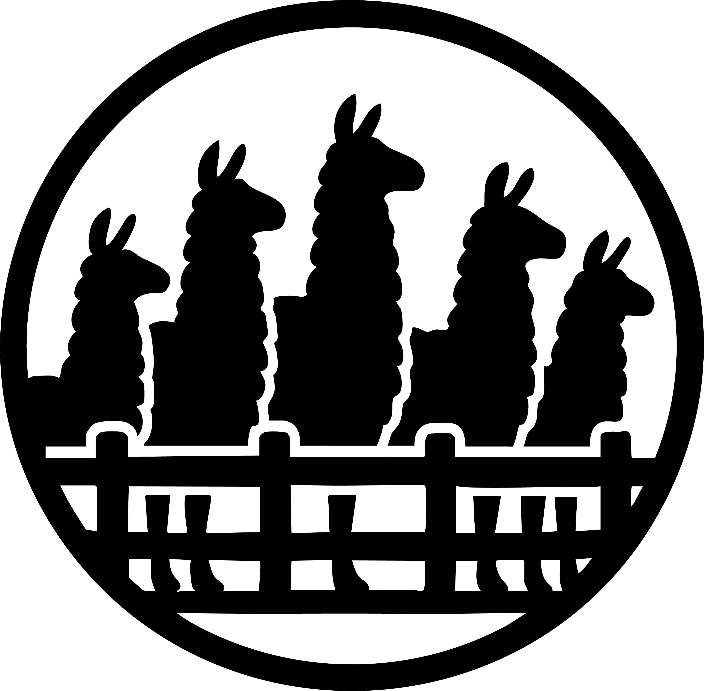

# Corral: Scientific Agent Benchmark

<p align="center">
    <a href="https://github.com/lamalab-org/mat-agent-bench/actions/workflows/tests.yaml">
        
    </a>
    <a href="https://pypi.org/project/corral">
        
    </a>
    <a href="https://github.com/lamalab-org/mat-agent-bench/blob/main/LICENSE.md">
        
    </a>
    <a href='https://lamalab-org.github.io/mat-agent-bench/'>
        
    </a>
    <a href="https://github.com/lamalab-org/mat-agent-bench/blob/main/CODE_OF_CONDUCT.md">
        
    </a>
</p>

<p align="center">
<picture>
  <source media="(prefers-color-scheme: dark)" srcset="docs/_static/corral_logo_final.png">
  
</picture>
</p>

A comprehensive benchmarking framework for evaluating AI agents on science tasks. The system provides standardized environments, tools, and evaluation metrics to test agent performance across diverse materials science challenges.

## 🚀 Getting Started

### Prerequisites

- Python 3.10 or higher
- `uv` (recommended) or `pip` for package management

### Installation

1. **Clone the repository**

   ```bash
   git clone https://github.com/lamalab-org/mat-agent-bench.git
   cd mat-agent-bench
   ```

2. **Install the framework**

   ```bash
   uv pip install -e .
   ```

3. **Install specific environment dependencies**

   ```bash
   # create task environments
   cd tasks/samplemath && uv venv && uv pip install -e .  # create an env for running sample math
   # ... repeat for other tasks as needed
   ```

### Quick Start

1. **Start a task environment server**

   ```bash
   cd tasks/samplemath/samplemath
   python env.py  # Starts server on http://localhost:8000
   ```

2. **Run benchmark in another terminal**

   ```python
   from corral import CorralRunner, CorralRouter
   from corral.agents import ReActAgent
   from corral.report import CorralWandbLogger

   # Setup interface
   interface = CorralRouter("http://localhost:8000")
   # Setup the WandB logger
   wandblogger = CorralWandbLogger(
       project="corral",
       group="experiment_group",
       name="run_name",
   )
   # Setup the agent
   agent = ReActAgent(model="gpt-4o", max_iterations=10, temperature=0.1)

   # Run benchmark
   runner = CorralRunner(interface, agent, logger=wandblogger)
   result = runner.bench()

   print(f"Overall score: {result.total_score:.2f}")
   ```

## 📊 Running Benchmarks

### Single Task Execution

```python
from corral import CorralRunner, CorralRouter
from corral.agents import ReActAgent

interface = CorralRouter("http://localhost:8000")
agent = ReActAgent(model="gpt-4o")
runner = CorralRunner(interface, agent)

# Run specific task
result = runner.bench(task_ids=["math_1"])
```

### Multiple Tasks

```python
# Run specific tasks
result = runner.bench(task_ids=["math_1", "math_2", "math_3"])

# Run all available tasks
result = runner.bench()  # Uses all tasks in the environment
```

### Multiple Trials with Different Parameters

```python
# Run multiple trials per task
result = runner.bench(
    task_ids=["math_1", "math_2"],
    trials_per_task=3,
    k_values=[1, 2, 3],  # Evaluate with different k values for pass@k metrics
    tool_verbosity="MINIMAL",  # Options: FULL, MINIMAL, NONE
)

# Evaluate with different k values for pass@k metrics
result = runner.bench(trials_per_task=5, k_values=[1, 2, 3, 4, 5])
```

## 🏗️ Available Environments

The framework includes several pre-built environments:

| Environment | Description |
|-------------|-------------|
| `samplemath` | Basic mathematical operations |
| `spectra_elu_easy` | Spectroscopy data analysis |
| `md_simulations` | Molecular dynamics setup |
| `catalyst` | Catalysis research tasks |
| `afm` | Atomic force microscopy |
| `md_tutorials` | MD tutorial completion |

## 🤖 Available Agents

The framework includes several built-in agent types:

### ReActAgent

Uses the ReAct (Reasoning and Acting) framework for step-by-step problem solving.

```python
from corral.agents import ReActAgent

agent = ReActAgent(
    model="gpt-4o",  # or "claude-3-5-sonnet-20241022" or any other model litellm supports
    temperature=0.1,
    max_iterations=10,
)
```

### ToolCallingAgent

Uses native function calling from LLM providers to solve tasks by leveraging built-in tool/function calling capabilities.

```python
from corral.agents import ToolCallingAgent

agent = ToolCallingAgent(
    model="gpt-4o",  # or "claude-3-5-sonnet-20241022" or any other model LiteLLM supports
    temperature=0.0,
    max_iterations=10,
)
```

### LLMPlanner

Uses hierarchical planning with high-level planning and low-level execution delegation to other agents.

```python
from corral.agents import LLMPlanner

agent = LLMPlanner(model="gpt-4o", temperature=0.1, max_iterations=5)
```

## 💾 Checkpoint System

The framework automatically saves checkpoints during benchmark runs.

Checkpoints are automatically searched and loaded when resuming interrupted runs.

## 📝 Logging Framework

Corral uses [loguru](https://github.com/Delgan/loguru) for flexible and powerful logging. The logging framework allows you to configure different handlers for different subsystems.

### Basic Usage

```python
from corral import setup_logging

# Initialize logging with default settings
setup_logging()
```

### Advanced Configuration

Configure subsystem-specific log files for better organization:

```python
from corral import setup_logging

setup_logging(
    level="INFO",
    console=True,
    log_dir="./logs",
    subsystem_files={
        "agents": "agents.log",      # Agent execution logs
        "backend": "backend.log",    # Task environment logs
        "router": "router.log",      # API routing logs
        "utils": "utils.log",        # Utility function logs
        "report": "report.log",      # Reporting logs
    },
    rotation="10 MB",       # Rotate when file reaches 10 MB
    retention="1 week",     # Keep logs for 1 week
    compression="zip"       # Compress rotated logs
)
```

### Production Setup Example

**Note**: For benchmark logs, do NOT use rotation or retention. Benchmark data should be preserved permanently.

```python
from corral import CorralRunner, CorralRouter, setup_logging
from corral.agents import ReActAgent

# Setup logging before running benchmarks
# NOTE: No rotation/retention for benchmark logs
setup_logging(
    level="INFO",
    log_dir="./benchmark_logs",
    subsystem_files={
        "agents": "agents.log",
        "router": "router.log",
    }
)

# Run your benchmark
interface = CorralRouter("http://localhost:8000")
agent = ReActAgent(model="gpt-4o", max_iterations=10)
runner = CorralRunner(interface, agent)
result = runner.bench()
```

For more details, see the [Logging Documentation](docs/logging.md).

## 🔧 Contributing

### Adding a New Environment

1. **Create environment directory**

   ```bash
   mkdir -p tasks/my_new_env/my_new_env
   cd tasks/my_new_env
   ```

2. **Create pyproject.toml**

   ```toml
   [project]
   name = "my_new_env"
   version = "0.1.0"
   dependencies = [
       "corral",
       # Add your specific dependencies
   ]
   ```

3. **Create tools**

   ```python
   # tasks/my_new_env/my_new_env/tools.py
   from corral.backend.tool import tool


   @tool
   def my_custom_tool(input_param: str) -> str:
       """Description of what the tool does.

       Args:
           input_param: Description of the parameter

       Returns:
           Description of the return value
       """
       # Your tool implementation
       return f"Processed: {input_param}"
   ```

   Note that the docstring has to be formatted correctly for the tool to be registered properly. This means it has to include a description of the parameters and return values as in the example above.

4. **Implement environment class**

   ```python
   # tasks/my_new_env/my_new_env/env.py
   from corral.backend import Environment
   from corral.backend.server import create_benchmark_server


   class MyEnvironment(Environment):
       def __init__(self, task_id: str, problem: str, answer: str):
           self.problem = problem
           self.correct_answer = answer
           super().__init__(task_id)

           # Add your tools
           self.add_tool(my_custom_tool)

       def get_task_prompt(self) -> str:
           return f"Solve this problem: {self.problem}"

       def score(self) -> float:
           if self.state.submitted_answer is None:
               return 0.0
           return 1.0 if self.state.submitted_answer == self.correct_answer else 0.0


   # Define your tasks
   environments = {
       "task_1": MyEnvironment("task_1", "Problem 1", "Answer 1"),
       "task_2": MyEnvironment("task_2", "Problem 2", "Answer 2"),
   }

   # Create server
   if __name__ == "__main__":
       app = create_benchmark_server(environments)
       import uvicorn

       uvicorn.run(app, host="0.0.0.0", port=8000)
   ```

### Adding a New Agent

1. **Create agent file**

   ```python
   # src/corral/agents/my_agent.py
   from corral.agents import BaseAgent
   from corral import CorralRunner


   class MyAgent(BaseAgent):
       def __init__(self, model: str, **kwargs):
           super().__init__(model, **kwargs)
           # Add your agent-specific initialization

       def run(self, interface: CorralRouter, task_id: str) -> str:
           # Get task information
           guide = interface.get_task_guide(task_id)

           # Your agent logic here
           # Use interface.execute_tool() to call tools

           return "Your final answer"
   ```

2. **Add to agent registry**

   ```python
   # src/corral/agents/__init__.py
   from .my_agent import MyAgent

   __all__ = ["MyAgent", ...]
   ```

3. **Test your agent**

   ```python
   from corral.agents.my_agent import MyAgent
   from corral import CorralRunner, CorralRouter

   agent = MyAgent(model="gpt-4o")
   interface = CorralRouter("http://localhost:8000")
   runner = CorralRunner(interface, agent)

   result = runner.bench()
   ```

### Development Setup

1. **Install development dependencies**

   ```bash
   uv pip install -e .
   ```

2. **Install pre-commit hooks with commitizen commits**

   ```bash
   pre-commit install --hook-type commit-msg --hook-type pre-push
   ```

## 📋 Advanced Usage

### Tool Creation

#### Standard Tools

```python
from corral.backend.tool import tool


@tool
def calculate_molecular_weight(formula: str) -> float:
    """Calculate molecular weight from chemical formula.

    Args:
        formula: Chemical formula (e.g., 'H2O', 'CH4')

    Returns:
        Molecular weight in g/mol
    """
    # Implementation here
    pass
```

#### [Modal](https://modal.com) Tools (Cloud Execution)

```python
from corral.utils.modal import modal_tool, MODAL_TOOL_REGISTRY
from modal import Image


@modal_tool(app=app, image=Image.debian_slim().pip_install("rdkit"), memory=1024)
def complex_calculation(data: str) -> str:
    """Run computationally intensive task in the cloud."""
    # This runs in Modal's cloud environment
    pass


# Access the tool
tool_instance = MODAL_TOOL_REGISTRY["complex_calculation"]
```

### Environment Configuration

For environments requiring file I/O:

```bash
export CORRAL_FS_PROTOCOL=local
export BASE_IO_PATH=/path/to/work/directory
```

### Evaluation Metrics

The framework provides comprehensive evaluation metrics:

```python
result = runner.bench(trials_per_task=10, k_values=[1, 3, 5])

# Access detailed results
print(f"Total score: {result.total_score}")
print(f"Pass@1: {result.pass_at_k[1]}")
print(f"Pass@3: {result.pass_at_k[3]}")
print(f"Average trials: {result.average_trials}")

# Per-task analysis
for task_id, task_result in result.task_results.items():
    print(f"Task {task_id}: {task_result.success_rate:.2f} success rate")
```

## 🤝 Community

- **Issues**: Report bugs and request features on [GitHub Issues](https://github.com/lamalab-org/mat-agent-bench/issues)
- **Discussions**: Join conversations on [GitHub Discussions](https://github.com/lamalab-org/mat-agent-bench/discussions)
- **Contributing**: See our [Contributing Guide](CONTRIBUTING.md)

## 📄 License

This project is licensed under the MIT License - see the [LICENSE](LICENSE.md) file for details.
