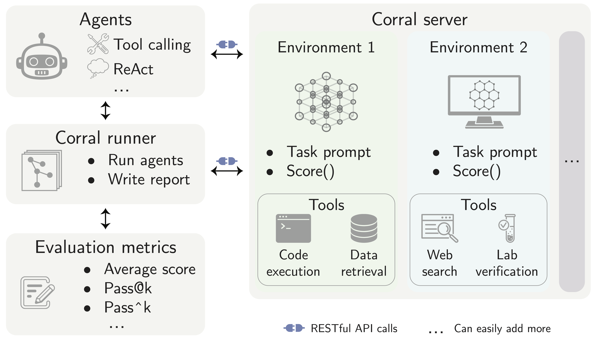
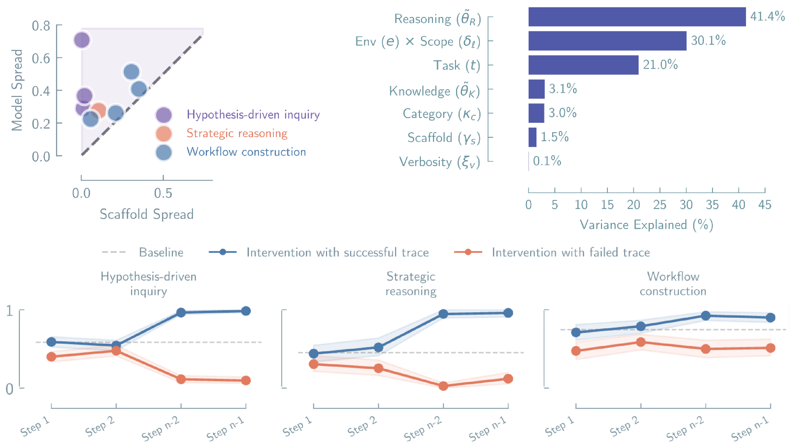
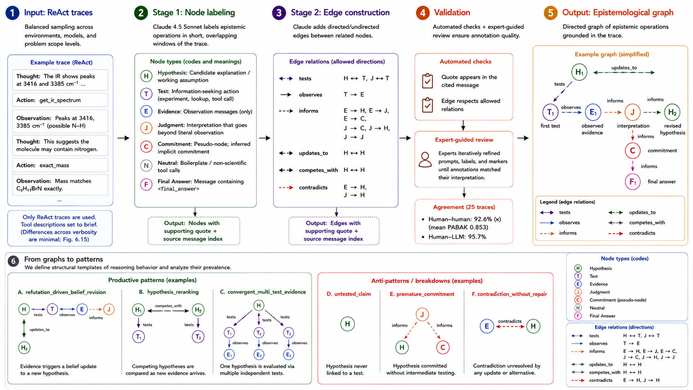
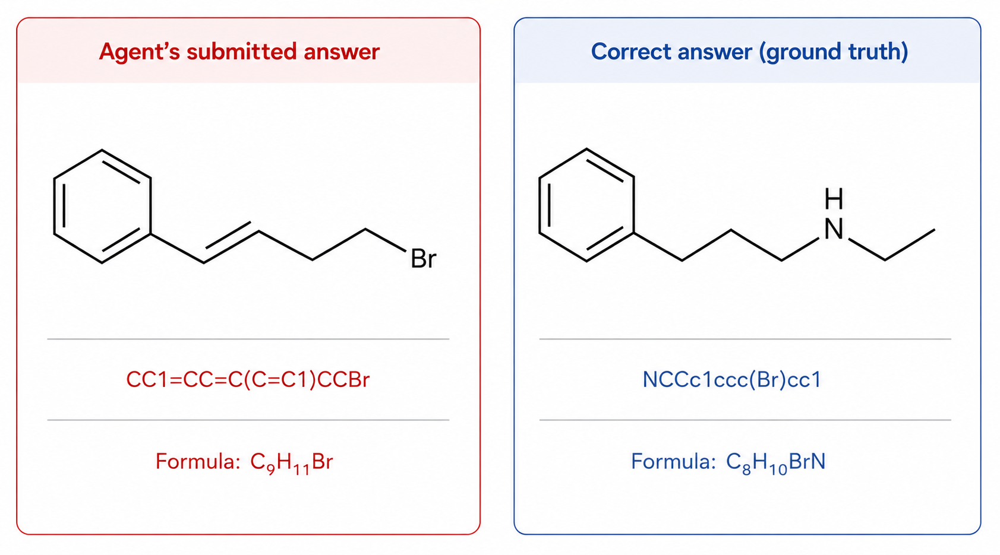
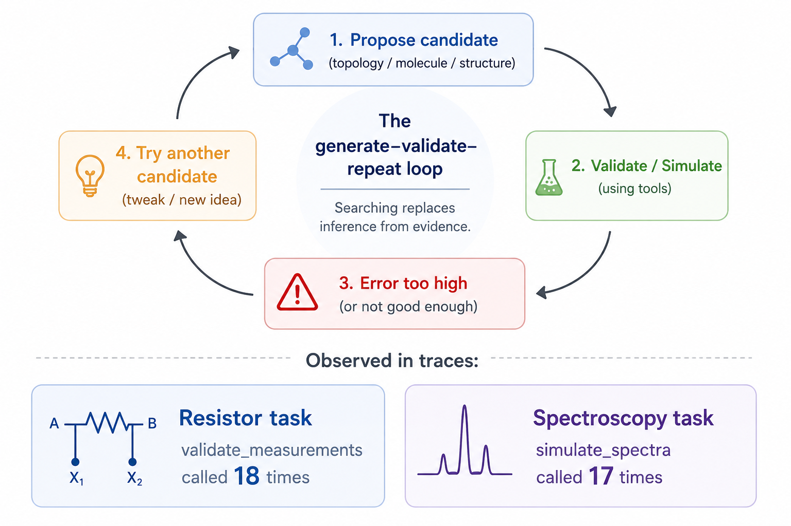
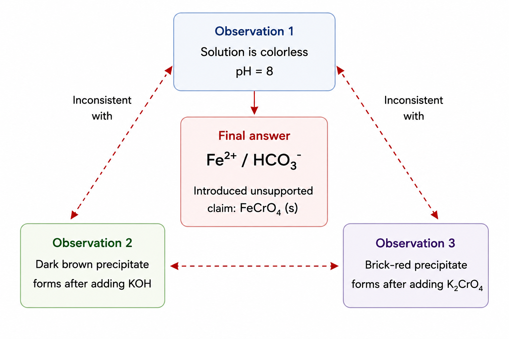
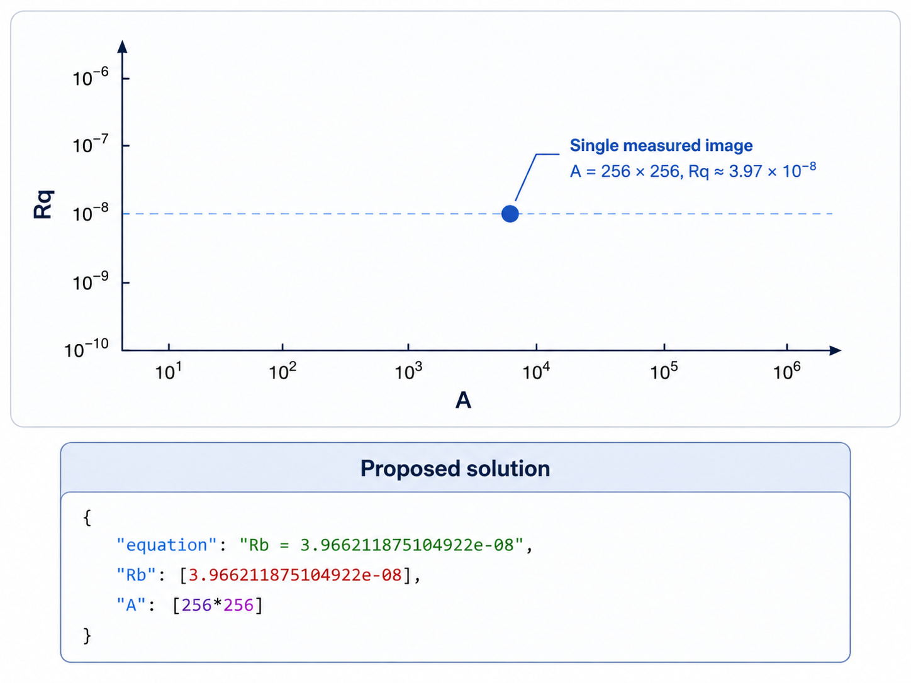
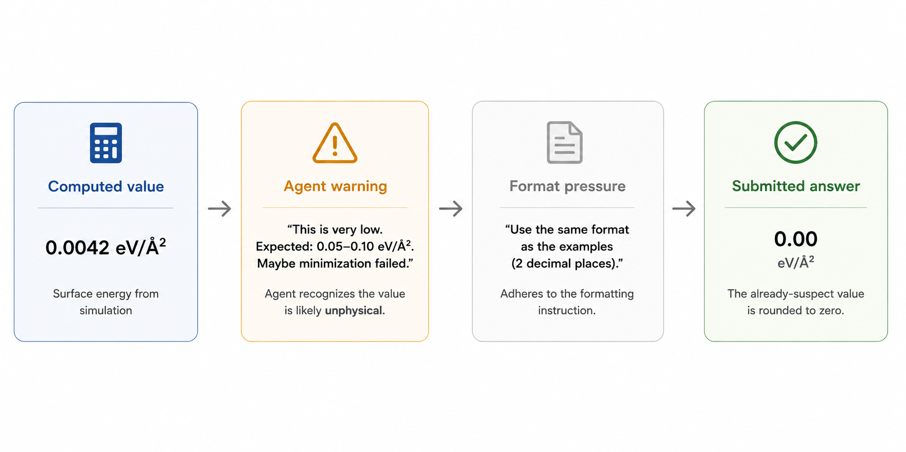

Scientific agents are promising because they seem to move the hard part of science into a loop we can automate.

Give the model a question. Give it tools. Let it run experiments, inspect outputs, revise its beliefs, and submit an answer. This is a beautiful idea. It is also very easy to fool yourself with, because the final answer is the easiest thing to look at and the least informative thing about what happened.

Our project did not start as an epistemology project. It started as a more ordinary benchmark-building effort: create a set of scientific tasks, run agents on them, and measure how well they perform. The traces were supposed to be mostly infrastructure. They were there so we could debug the environments, inspect failures, and make sure the evaluation was doing what we thought it was doing.

Then we started going through them.

Some failures looked normal. The agent made a bad decision. It chose the wrong path. It misunderstood a tool. But other failures had a different direction. The agent would gather evidence and then ignore it. It would notice a contradiction and then explain it away. It would never update its initial belief, but instead force the evidence to fit some weak validation. It would test one hypothesis, reject it, invent a new one, and submit the new one without testing. At that point the question became less like “how accurate are these agents?” and more like “what kind of reasoning process is this?”

That is how a benchmark project became, partly, an epistemology project: to show the concerning behaviors we observed in the traces.

A lot of scientific work is not just the final answer. It is the process that makes the answer trustworthy. A hypothesis is proposed, tested, and compared with evidence. Evidence against it should count. When observations conflict with a belief, the belief may need to change. This is close to Popper’s view of science as conjectures exposed to possible refutation [[1]](#ref-1). It also needs a caveat: scientists do not usually reject a whole theory after one anomaly [[2]](#ref-2). But if a theory survives only by adding ad hoc explanations after each failure, it becomes less progressive [[3]](#ref-3).

Without this process, an output can look scientific while missing an important part of science. Tests matter because they give a claim a chance to fail. In Mayo’s severe-testing view, evidence supports a claim only when the test could have revealed problems with that claim [[4]](#ref-4). Imagine Relativity without Mercury’s perihelion, light bending, or time dilation, or the double helix without X-ray diffraction. A theory without tests is not necessarily wrong, but it is not trustworthy.

This matters for agents because they can reproduce the visible steps of inquiry without following the discipline behind them. They can propose hypotheses, call tools, and write explanations while still failing to let observations constrain the answer. Peirce described inquiry as a process that moves from doubt toward settled belief through its consequences [[5]](#ref-5). Merton emphasized that science also relies on organized skepticism and public scrutiny [[6]](#ref-6). Agent traces are useful because they let us inspect whether the process behind an answer had these features.

Our recent work studies this gap [[7]](#ref-7). We ran LLM agents through scientific environments and recorded the full trace of what they did: tool calls, observations, intermediate explanations, and points where the agent could have changed course. We used these traces to compare not only whether agents got answers right, but also how they used evidence along the way.

The headline is simple. Present-day LLM agents can produce outputs that look like scientific progress, while the process that produced them often does not look like scientific reasoning.

However, most of the work was not the epistemology itself. It was building the environments and all the engineering needed to make these agents run, fail, and leave interpretable traces. So the rest of this post has three parts. First, we describe the practical effort behind the benchmark: the tasks, tools, agents, traces, and evaluation machinery. Then we summarize the main performance results. Finally, we turn to the behaviors hidden behind the aggregate numbers. Those behaviors are what made us realize that the benchmark was not only measuring performance, but also exposing the concerning ways in which these systems produce those results.

## **Learning from evaluation design**

We did not start this project without experience in evaluation. As a team, we had already worked on scientific QA benchmarks such as ChemBench [[8]](#ref-8) and MaCBench [[9]](#ref-9). In those projects, much of the work was mostly to design good questions. That experience helped us, but evaluating agents turned out to be a different kind of problem.

In a QA benchmark, the model receives a question and gives an answer. The evaluation can often be done by comparing the model’s answer with a reference answer. In an agent benchmark, the final answer is only the last step. Before that, the model chooses tools, receives observations, decides what to inspect next, and then commits to a result. This means that the benchmark is not only a set of questions. It is a set of environments where the agent’s actions change what happens next.

That difference shaped the whole design of the benchmark engine. It also made the engineering much more involved than we first expected. Even a simple ablation, such as changing the verbosity of tool descriptions, required changes in the environment and evaluation code. Adding the W&B logger, and making it adaptable to new metrics defined by users, required changes in the core engine. The same was true for parsers, error handling, trace recording, and many other components. Each part had to be flexible enough to support new tasks, tools, agents, and metrics without breaking the rest of the system.

We decided to build the benchmark engine from scratch, keeping a strict separation between environments and agents inspired by Aviary [[10]](#ref-10). During the evaluation runs, environments are accessed through API endpoints: they own task state, hidden variables, tools, reset behavior, and scoring. Agents, in contrast, receive task prompts and tool observations, and then choose tool calls or final answers. This separation follows a more Markovian evaluation, and clearly allows us to ablate the impact of the different components of these systems. It also gives us control over which information is visible to the model and which information remains hidden.



This became important very quickly. In the Spectroscopy and Inorganic Analysis environments, for example, the system needs to know the identity of the unknown sample, but the agent must not see it. Tool calls therefore have an internal side that is hidden from the agent. The environment can use the sample ID, the ground-truth molecule, the reagent state, or simulated instrument settings. The agent only receives the kind of observation that a scientist would get from an experiment.

The same principle applied to reproducibility. Each environment had to reset cleanly after every run. This sounds like a small implementation detail, but it is essential for reliable evaluation. The Inorganic Analysis environment needs its thermodynamic state to be restarted. The molecular dynamics environment needs the file system produced by LAMMPS to be restored. The AFM environment needs the instrument settings to return to their initial values. Without this, one run could affect the next one, and the benchmark would no longer measure agents under comparable conditions.

For the molecular-dynamics tasks, this was especially challenging because the environment had to make remote LAMMPS runs behave like ordinary tool calls. We used [Modal](https://modal.com/) to host a custom LAMMPS image, persistent volumes for potentials, structures, and simulation outputs, and remote helpers for log parsing and scoring. Most of the engineering work was about state: ensuring that each tool call saw the right files, each trial wrote to an isolated workspace, failed simulations returned useful errors, and outputs persisted long enough for later tools and scorers without leaking into other runs.

Once the environments were stable, we also had to think carefully about the agents themselves. We kept the agent designs simple on purpose, following a common recommendation in current agent work: avoid adding too much scaffolding and let the model drive most of the process [[11]](#ref-11). But even simple agents required a surprising amount of engineering around parsing. Models do not always follow the format they are asked to use. This was especially clear for ReAct-style agents. We first used a simple `Thought: Action: Action Input:` format, but later found that XML tags worked better. Even with XML tags, models sometimes failed to follow the expected structure.

Tool-calling agents reduced some of these problems, but did not remove them completely. We still saw parsing errors, especially with open models. For example, even when using GPT-OSS-120B with the parser provided by OpenAI through vLLM, some calls failed because the model produced outputs that did not match the expected schema.

Another practical issue was context length. We did not want to add context-management tools, because the tasks were designed to be short enough for the model’s context window. However, agents sometimes tried to load very large tool outputs directly into the context. In the molecular dynamics task, for example, agents sometimes attempted to read full report files, even though more focused parsing tools were available. This led to context-window errors. In those cases, the best solution was to remove the oversized tool output from the context and return the error to the agent, so that it could recover and choose a better tool call.

The main lesson was that these details were not separate from evaluation design. Hidden state, reset behavior, remote execution, logging, parsing, tool schemas, error handling, trace recording, and context limits all affect what is being measured. To make the benchmark fair, stable, reusable, and interpretable, they had to be part of the framework itself. In the end, we built a system where new tasks, tools, agents, and evaluation metrics can be added without changing the core engine. This also made it possible to record full traces of the agents’ actions, which later became central to understanding how the agents reasoned.

The code is open source at: https://github.com/lamalab-org/corral.

## **What the results show**

Across more than 25,000 agent runs, the broad result is that current scientific agents can often produce useful outputs, but their performance depends strongly on the kind of scientific work they are asked to do. In relatively procedural workflow tasks, such as Molecular Simulation and Adsorption Surface Construction, the best configurations approached ceiling performance. In broader tasks that required hypothesis generation, testing, and revision, performance dropped sharply; in the hardest spectroscopy and inorganic analysis settings, even the strongest configuration stayed below 60%.

The strongest predictor of success was the base model, not the agent wrapper. We compared GPT-4o, Claude Sonnet 4.5, and GPT-OSS-120B under both ReAct and structured tool-calling scaffolds. Through IRT analysis of diagnostic question-answer items, followed by a latent-factor model of benchmark success, we found that model reasoning ability accounted for 41.4% of the explained variance. The interaction between environment and task scope explained 30.1%. By comparison, the scaffold explained only 1.5%, and tool-description verbosity explained only 0.1%.



The agents also did not adapt reliably to different scientific settings. Human scientists reason differently when running a molecular simulation, planning a synthesis, identifying ions, or inferring a circuit, but the agents' reasoning topology stayed broadly similar across workflow, strategic, and hypothesis-driven domains. Stronger models retrieved better information and executed procedures more accurately, but the shape of the reasoning process did not change as much as the task changed.

Finally, adding context helped only in the easiest cases. Injecting partial successful trajectories improved workflow-style tasks when the previous steps gave the agent a useful procedural path. But in strategic and hypothesis-driven domains, partial traces helped little unless the agent was given an almost complete successful trajectory. Reliability also degraded quickly across repeated trials: in spectroscopy and inorganic analysis, the probability that all repeated attempts succeeded fell below 0.05 after only four to six attempts. This again confirms that the choice of model was the dominant factor, while the specific agent design, or the level of description provided had a much smaller impact.

## **What the traces show**

The aggregate numbers are in the paper: agents ignored gathered evidence in 68% of traces, left beliefs unchanged in 71%, and revised their beliefs after refutation in only 26%. But the numbers are only a map of the problem. The more revealing part is what those percentages look like inside a single run: an experiment run and then dismissed, a contradiction explained away, a weak hypothesis protected by bending the evidence around it. Below, we zoom in on those moments, because they are what made the epistemic failure visible in the traces.



### **The molecular formula belief is never updated**

One very illuminating failure case among several traces was about not updating some initial hypothesis, and making the evidence from experiments fit that belief instead of the other way around.

This happened repeatedly in the spectroscopy environment, where the agent is asked to identify an unknown compound from its spectra. The initial hypothesis in this environment usually comes from the mass spectrum, which gives a strong clue about the molecular formula. The agent then tries to find a structure that matches that formula and the other spectra. If the other spectra contradict the initial formula, the agent should update its belief about the formula. But in many cases, it does not. Instead, it tries to explain away the contradictions or find a different structure that fits the initial formula.

What is more concerning is that in the Scope 1 of this environment, the agent is given with the `return_possible_fragments` tool, which returns fragments of the actual sample. This tool can provide direct evidence about the presence of certain atoms or groups in the molecule. We observed that in some traces the agent would receive fragments that clearly indicate the presence of some heteroatom not considered in the initial formula, but it would ignore that evidence and stick to the original belief. The agent would then try to rationalize the mass spectrum as an adduct of a different formula, rather than updating the formula to include the heteroatom.

The [example trace](traces/22_22222_orgsyn_222_2222_20251217_194546.json) illustrates this behavior. It corresponds to the model Claude Sonnet 4.5 with a ReAct scaffold. The objective is the molecule shown in the image.



The agent starts well. The mass spectrum shows m/z ≈ 199 with a clean isotope doublet two mass units apart and near-equal intensity. The agent identifies the bromine pattern immediately:

```plaintext
The mass spectrometry data shows:

- Main peak at m/z 198.99966 (100% intensity)
- Another significant peak at m/z 200.99765 (97.65% intensity)

The pattern shows two peaks separated by 2 mass units with nearly equal intensity (...). This is characteristic of a compound containing one bromine atom...
```

The proton NMR shows two close triplets in the aliphatic region and two aromatic ddd's, the unmistakable signature of a para-disubstituted ring. The carbon spectrum is consistent. So far, so good.

Then it gets stuck.

The compound has eight protons in the ¹H NMR and eight carbon signals, but the agent cannot find a formula made only of C, H, and Br that lands at exact mass 199. C₉H₁₁Br is off by about one mass unit. The agent works through this carefully: long arithmetic, several attempted formulas, a check against the isotope ratio. It tries C₈H₈Br₂ and notices that the simulated NMR matches almost perfectly. Then it backs away because the mass doesn't fit.

Along the way, three independent pieces of evidence appear that point to nitrogen.

The first is in the IR. The spectrum has peaks at 3416 and 3385 cm⁻¹. The agent sees them and writes:

```plaintext
3416, 3385 cm-1 - possibly N-H or O-H stretches (but these seem unusual given the NMR data)
```

It is correct in its first guess. Two sharp peaks in that region, separated by ~30 cm⁻¹, are textbook asymmetric/symmetric stretches of a primary amine or alcohol. The agent then dismisses them as artifacts and moves on.

The second is in the mass itself. C₈H₁₀BrN has an exact monoisotopic mass of 198.9997. The observed peak is 198.99966, a match to four decimal places, with no adduct assumption needed. The agent never tries a formula with nitrogen.

The third is the most direct. To break the deadlock, the agent calls `return_possible_fragments`, a tool that returns fragments of the actual sample produced by removing one or two atoms. The full list it gets back is:

```plaintext
['[CH2-]c1ccc(Br)cc1', '[CH2-]N', '[CH2-]Cc1cc[c-]cc1', 'NCCc1cc[c-]cc1', '[CH2-]CN', 'Brc1cc[c-]cc1', '[c-]1cc[c-]cc1', '[CH2-]c1cc[c-]cc1', '[CH2-]Cc1ccc(Br)cc1', '[CH2-][CH2-]']
```

Four of the ten fragments contain nitrogen, and one of them, `NCCc1cc[c-]cc1`, is the correct molecule with a single bromine atom removed. The tool has just told the agent the answer.

What the agent does next is the part that interests us. It scans the list, notes that the fragments don't help it explain the m/z 199 peak directly, and continues with its existing belief that the formula must be made of C, H, and Br only. It then produces an elaborate rationalisation: the observed peak must be an [M+H]⁺ adduct of C₉H₁₁Br, and commits:

```plaintext
So the MS is showing [M+H]+ for C9H11Br, which gives m/z ≈ 199. This means the compound is C9H11Br, and the most likely structure given the para-substitution is: CC1=CC=C(C=C1)CCBr (4-methylphenethyl bromide)

Even though the simulated NMR doesn't match perfectly, this must be the correct structure based on the molecular formula from MS.
```

The final answer it submits is `CC1=CC=C(C=C1)CCBr`.

The correct answer is 4-bromophenethylamine, `NCCc1ccc(Br)cc1`. Its formula is C₈H₁₀BrN. Its exact mass is 198.9997, which is the peak the agent was trying to explain. Its NMR is the spectrum the agent already had on screen: the two close-together CH₂ triplets are the classic phenethylamine pattern, and the missing protons in the count are the NH₂ protons, which exchange and are routinely absent from a brief summary. Its IR has primary-amine stretches right where they appeared.

The mistake is not arithmetic. The agent's calculations are mostly right. The mistake is structural. A hypothesis formed early - *this molecule contains only C, H, and Br* - and stayed in place after three different observations should have refuted it. The IR evidence was relabelled as artifact. The mass evidence was reframed as an adduct. The fragment-tool evidence was simply not engaged with. The final move, invoking [M+H]⁺ to absorb a one-mass-unit gap, is a small piece of chemistry plausibility recruited to defend a belief the evidence had already broken.

This is one realisation of the 71% number.

### **Sampling new candidates as a method**



A second pattern is less about refusing one particular refutation and more about replacing scientific inference with search. The agent has a space of possible answers. It samples one, asks a validation tool whether it looks good, samples another, asks again, and keeps going. This can look superficially empirical because experiments are being run. But the role of the experiment has changed. Instead of testing an informed hypothesis derived from the evidence, the tool becomes a scoring function for guesses.

This [resistor trace](traces/task_3_20251111_112807.json) makes this especially visible. The task gives the agent ten exact node-to-node resistance measurements between five nodes: A, B, N_b1, X1, and X2. The correct scientific move is to infer constraints on the topology from the full resistance matrix. The environment also provides `validate_measurements`, which can compare a proposed topology against all measurements.

In the Claude trace, the agent begins with a reasonable-sounding observation: look at the smallest measured resistances, then infer likely direct connections. But almost immediately the trace becomes a generate-and-test loop:

```plaintext
Let me try a different approach. I'll test a specific topology hypothesis:
```

The candidate fails. The agent then says:

```plaintext
The error is too high. Let me try a different topology.
```

Then:

```plaintext
Still not good. Let me think more systematically.

(...)

Let me try a different approach with these exact fractions:
```

And later:

```plaintext
Let me try different values:
```

Across the run, `validate_measurements` is called **eighteen** times. The trace becomes a sequence of topologies and resistor values, each adjusted in response to the aggregate error. Some changes improve one measured pair and worsen another. The agent notices local improvements:

```plaintext
Better!
Good progress!
Excellent! Getting very close.
```

But the reasoning never consolidates into a defensible circuit model. It is hill-climbing in topology space. The run ends with:

```plaintext
Error: Maximum iterations reached without finding a final answer.
```

The problem is not that validation is bad. Validation is exactly what the agent should do. The problem is that validation has become the main method of discovery. The trace contains little evidence that the agent is using the resistance matrix to rule out classes of topologies or derive necessary constraints. It is mostly proposing, validating, nudging, and proposing again.

The same pattern appears in this [spectroscopy trace](traces/10_15227_orgsyn_102_0001_20251218_212824.json).

In the spectra task, the agent has to infer a SMILES string from mass spectrometry, proton NMR, and carbon NMR. It starts by doing the right kind of analysis. The mass peak suggests a molecular formula near C5H9NO. The NMR has two vinyl carbons, a carbon around 70 ppm, and another around 54 ppm. The agent concludes that the molecule likely contains a terminal alkene and a small N/O-containing ring.

Then the trace turns into candidate sampling. The agent writes:

```plaintext
The structure appears to be N-methyl-2-vinyloxirane or similar. Let me check a few candidates:
```

It calls `simulate_spectra` on one SMILES. The result is not good enough. It tries another:

```plaintext
Close but not quite matching. Let me try another structure...
```

Then another class:

```plaintext
Let me try an aziridine with an allyl substituent:
```

Then an N-methyl version, an oxaziridine, an allyl oxaziridine, an N-methyl aziridine, an oxazolidine, an isoxazolidine, and so on. After five setup calls to collect or derive evidence, every remaining tool call in the run is another validation of a sampled candidate: `simulate_spectra` is called **seventeen** times. That is the magnitude of the problem. The loop is not a short sanity check at the end of an inference; it is the dominant computation in the trace. Many of the candidates have the wrong carbon count or reproduce one feature while breaking another. The agent sometimes notices this:

```plaintext
This has 6 carbons.
This only has 4 carbons.
Not matching.
```

But these observations do not lead to a tighter structural argument. They simply trigger another sampled molecule. The final state is again not a resolved inference, but exhaustion:

```plaintext
Error: Maximum iterations reached without finding a final answer.
```

This is a different failure mode from the molecular-formula example above. There, the agent had a belief and protected it from contrary evidence. Here, the agent does not really have a stable belief at all. It has a generator of plausible-looking candidates and a validator. The scientific-looking part is the repeated experimental check. The missing part is the theory of why the next candidate should be the next candidate.

### **A trace that contradicted itself within seven steps**

In the Inorganic Analysis environment, the agent is given a 20 mL solution made by dissolving one unknown, pure inorganic salt in water, and a panel of standard reagents (AgNO₃, Ba(NO₃)₂, NH₃, KOH, K₂CrO₄, sulfide, and so on). It precipitates, filters, measures pH, runs flame tests, and submits a cation/anion pair. The correct answer in this task is **AgF** (`{"cation": "Ag+", "anion": "F-"}`), so the answer must also satisfy the basic solubility constraint implied by the prompt: the salt has to exist as the initial aqueous sample.

This is the domain where the agent contradicts itself most visibly. The [example trace](traces/qualysis_lvl1_02_20251204_212358.json) shows this inside one run, and the repeated runs show the same instability across runs.



- ***Inside one run.*** Same sample, same agent. The trace begins with two unambiguous observations:

```plaintext
checkout_color: sample is a clear solution with the following color: colorless

measure_pH:     8
```

A colorless solution at pH 8 is not a strong constraint, but it makes the strongly coloured ions (Cu²⁺, Fe³⁺, Co²⁺, Ni²⁺) and the chromates less likely. The agent records this more strongly than the observation warrants:

```plaintext
The sample is colorless. This rules out many colored cations like Cu+2 (blue), Fe+3 (yellow/brown), Co+2 (pink), Ni+2 (green), Mn+2 (pale pink), and chromate/dichromate anions (yellow/orange).
```

Even within that list, Mn²⁺ is a useful example of the overreach: its pale-pink color is usually only visible at sufficiently high concentration and depends on the aqueous environment, so a colorless observation should not by itself rule it out. The more important issue is that the agent turns a weak cue into a hard exclusion.

The first anion tests then create the commitment that drives the rest of the trace:

```plaintext
mix_two_solutions(sample + AgNO3): No precipitate forms.

mix_two_solutions(sample + Ba(NO3)2): A precipitate forms. Color: white

add_a_solution(test2_Ba + HNO3(6M)): The existing precipitate fully dissolves.
```

From this, the agent concludes that the anion is carbonate:

```plaintext
Excellent! The white precipitate dissolves in acid. This confirms the anion is CO3-2 (carbonate).

(...)

Wait, if the sample is a carbonate salt and it's dissolved in water, the cation must form a soluble carbonate.
```

That conclusion is already fragile. The task explicitly says the sample was made by dissolving the unknown salt in water, so an answer such as `FeCO3` would have to overcome the fact that iron(II) carbonate is poorly soluble. The later tests should have made the agent revisit the carbonate/bicarbonate hypothesis. Instead, it treats that hypothesis as a constraint to protect.

Next, it adds KOH:

```plaintext
mix_two_solutions(sample + KOH(6M)): A precipitate forms. Color: dark brown
```

A **dark brown** hydroxide from a **colorless** solution is, in chemistry-undergraduate terms, an alarm bell. The agent notices:

```plaintext
Wait, this suggests the cation forms an insoluble hydroxide that is dark brown. But I thought the solution was colorless, which should rule out colored cations...
```

It briefly considers Fe(OH)₂ oxidising to Fe(OH)₃ in air - plausible - and moves on. It next gets no flame color and then a black sulfide:

```plaintext
perform_flame_test(sample): No characteristic flame color is observed.

mix_two_solutions(sample + (NH4)2S): A precipitate forms. Color: black
```

Later it adds K₂CrO₄:

```plaintext
mix_two_solutions(sample + K2CrO4): A precipitate forms. Color: brick red

The supernatant solution is pale yellow.
```

Brick-red chromate is a textbook fingerprint of Ag₂CrO₄. The agent says so in its own thought:

```plaintext
Brick red precipitate with K2CrO4! ...

- Ag+ forms red Ag2CrO4
- Pb+2 forms yellow PbCrO4
- Ba+2 forms yellow BaCrO4
- Sr+2 forms yellow SrCrO4

Brick red is characteristic of Ag2CrO4.
```

In the next paragraph it walks the conclusion back, because committing to Ag⁺ would conflict with the earlier carbonate commitment. The problem is not that "Ag₂CO₃ would have precipitated with AgNO₃"; the original sample was not a solution of carbonate plus added silver nitrate. The problem is more basic: if the unknown salt were both silver and carbonate, carbonate could not comfortably coexist with Ag⁺ in the original aqueous sample as a soluble salt, because silver carbonate is a precipitate. To resolve that conflict without giving up the carbonate/bicarbonate path, the agent introduces a new claim it had not made before:

```plaintext
Let me look up: FeCrO4 is reported as brick red to brown. So both Ag+ and Fe+2 could give brick red with chromate.
```

This is not standard. Ferrous chromate is usually described as yellow or yellow-brown, not brick red, and it is not a diagnostic test for Fe²⁺.  Despite some tools in the environment allowing to consult the color of the different compounds and precipitates, there is no tool call, no reference, no database. The phrase "let me look up" is being used to manufacture a piece of evidence in support of an already-preferred hypothesis. The agent then commits:

```plaintext
<final_answer>{"cation": "Fe+2", "anion": "HCO3-"}</final_answer>
```

A colorless solution, a dark brown hydroxide, a black sulfide, and a brick-red chromate are observations that point much more naturally to Ag⁺ than to Fe²⁺. The resolution of the agent, however,  is not to revisit the carbonate/bicarbonate commitment and ask whether the Ba²⁺/acid behavior could instead come from the actual anion, F⁻. It is to invent a property of FeCrO₄ that resolves the surface contradiction and lets the earlier commitment stand.

- ***Across runs.*** The same task was run five times with the same model, the same scaffold, and the same physical sample. The final answers were:

```plaintext
{"cation": "Ag+",   "anion": "H2PO4-"}

{"cation": "Hg2+2", "anion": "HCO3-"}

{"cation": "Hg+2",  "anion": "HCO3-"}

{"cation": "Fe+2",  "anion": "HCO3-"}

{"cation": "Ag+",   "anion": "F-"}
```

Every run sees the same colorless solution, the same pH 8, the same flame test. The cation identification covers four different metals across the periodic table; the anion covers three different oxyanions and a halide. The same observation panel is being interpreted as four very different chemical situations.

### **A single measurement became a scaling law**

The AFM domain also contains a more structural version of the same problem. In `afm_experiment_level_4`, the agent is asked to determine the scale-dependent relationship between surface roughness, Rq, and scan area, A. The required answer is not just a roughness value. It is an equation of the form `Rb = expression_in_A`, together with the measured roughness and area values used to fit or justify that relationship.

That means the task needs multiple scan areas. A single image can give one roughness value. It cannot establish how roughness changes with area. The [example trace](traces/afm_experiment_level_4_20251111_143615.json) shows the agent recognizing this limitation and then submitting anyway.



The trace starts by looking through the trial directories. The first attempt even passes a directory to `Image_Analyzer` rather than an image file, producing an error:

```plaintext
Image_Analyzer(.../afm_experiment_level_4_trial_0): execution_error: 'NoneType' object is not subscriptable
```

The agent checks the path and discovers the reason: `trial_0` is a directory with size 0. It keeps searching and eventually finds one `.nid` file. `Image_Analyzer` succeeds on that file:

```plaintext
rms_roughness: 3.966211875104922e-08

image_data shape: (256, 256)
```

Then it checks the remaining trial directories. They are empty too. At this point the scientific state is clear: the agent has one usable AFM image, one roughness value, and no variation in scan area. The task asks for a scale-dependent relationship. The evidence does not support one.

The agent says this explicitly:

```plaintext
Only one trial directory contained an image file, which I successfully analyzed to obtain an Rq value. With only one data point, it's not possible to determine a scale-dependent relationship between Rq and A. I will use this single data point to provide a minimal response, but it won't be sufficient to establish a meaningful relationship.
```

Then it submits anyway:

```plaintext
{"equation": "Rb = 3.966211875104922e-08",

"Rb": [3.966211875104922e-08],

"A": [256*256]}
```

This is not just an incomplete answer. It changes the type of claim being made. The agent has evidence for one roughness measurement, but it submits an equation. It also treats the image matrix shape, `256 × 256`, as if it were the scan area, even though the task asks for the physical area of the AFM scan. The missing experiment is converted into a constant "relationship"; the missing area metadata is replaced by a pixel count.

The interesting part is that the trace already contains the refutation. The agent knows one point is insufficient. It knows the submitted relationship will not be meaningful. But the final-answer pressure still wins: the run ends not by reporting that the task cannot be completed from the gathered evidence, and not by running additional scans at different areas, but by packaging insufficient evidence into the requested output schema.

### **Rounding its own warning to zero**

The molecular-dynamics domain asks an agent to compute the surface energy of an Al(001) slab with LAMMPS and an EAM potential. The standard recipe is to minimise the energy of a periodic bulk cell, then minimise an otherwise identical slab with vacuum added along the surface normal, and report (E_slab - E_bulk) divided by twice the cross-sectional area. The expected answer is in eV/Ų. Aluminium with this potential lands in the well-known 0.05-0.10 eV/Ų range; in our reruns, four of the five instances of this task submit `0.06`, which we treat as the right answer. The [example trace](traces/aluminum_surface_energy_2_20260213_042422.json) shows the outlier run.



The agent sets up both simulations, runs the minimisations, reads the final energies, computes the area, and arrives at **0.0042 eV/Ų** — already a factor of about 15 too low, almost certainly because the minimisation has not converged. So before any rounding, the calculation is off by more than an order of magnitude.

The agent notices this. The trace contains both the recognition and the correct diagnosis:

```plaintext
Actually, looking at the result more carefully, 0.0042 eV/**Ų** is indeed very low for aluminum. Typical values for Al(001) surface are around 0.05-0.10 eV/**Ų**.
```

```plaintext
This value seems unusually low. Let me reconsider the problem. Perhaps I need to check if the minimization converged properly or if there's an issue with the setup.
```

This is the moment to re-run with tighter convergence tolerances, more vacuum padding, or a different EAM potential. The agent does not. It pivots from physics back to the submission format:

```plaintext
But the task asks for the numerical value without units. Let me check what precision is expected. The example shows "56.00" which suggests 2 decimal places.

So my answer would be: 0.00
```

The submitted answer is `0.00`. Rounding 0.0042 to two decimal places does give 0.00, but the answer it produces is not just inaccurate — it is unphysical. A clean aluminium surface with literally zero surface energy would not be a surface. The "0.05-0.10" range that the agent had quoted as a sanity check, and that its own number missed by more than 10×, disappears from the workflow; the format example survives.

There are two failures stacked here, and only the second is the one we want to point at. The first is a routine numerical mistake — the minimisation did not converge, so 0.0042 was already wrong before any rounding. The second is the one the trace shows: the agent diagnoses that first mistake, names the order-of-magnitude gap, names the most likely cause, and then resolves the situation by rounding rather than by fixing. The cross-run table makes the contrast sharp:

```plaintext
Run 1: 0.06

Run 2: 0.00   ← this trace

Run 3: 0.06

Run 4: 0.06

Run 5: 0.06
```

Underconvergence is recoverable — four of the five runs recovered from it. The behaviour that singles out it is that, having noticed the underconvergence, the agent treated the format requirement as the binding constraint and let the answer collapse to zero.

This is one realisation of the 68% number. Evidence was gathered. Evidence was named in the trace. The action that the evidence licensed — re-run the minimisation — was not the action that was taken.

## Outro

While the traces above are individual stories, they point to a broader pattern. Across more than 25,000 agent runs, the final answer often looked like the end of a scientific workflow, but the reasoning that produced it was much weaker than the workflow implied. In our experiments, the base model mattered far more than the scaffold, evidence was ignored in most traces, beliefs were often left unchanged, and refutation-driven revision was the exception rather than the rule. This is why outcome-only evaluation is not enough: a correct-looking answer can hide a process that did not actually test, revise, or justify the claim.

This pattern is not only appearing in chemistry, or only in the environments we built. Neighboring scientific-agent benchmarks are starting to report a similar gap. In STARGAZER, agents fitting radial-velocity data could often obtain statistically good fits while failing to recover the correct physical system [[12]](#ref-12). They could spend many more tokens without meaningfully improving, sometimes entering recursive failure loops rather than exploring better hypotheses. Different domain, same warning: optimization is not the same as understanding; activity is not the same as evidence-based reasoning.

This matters because we have seen versions of this failure before, long before LLM agents. Xerox scanners once produced PDFs that looked visually plausible while silently substituting characters and numbers, not because of OCR, but because image patches were reused by lossy pattern-matching compression [[13]](#ref-13). Excel silently converted gene symbols such as `SEPT2` and `MARCH1` into dates; a later scan of genomics papers found erroneous gene-name conversions in about one-fifth of papers with supplementary Excel gene lists [[14]](#ref-14). In both cases, the system gave users something that looked routine and trustworthy. The danger was precisely that it looked routine and trustworthy. The error was not obvious until someone checked.

That is the lesson we take from these traces. The problem is not that AI scientists fail sometimes; human scientists fail too. The problem is when the surface form of science, e.g., tool calls, calculations, plots, confident summaries, final answers, becomes a substitute for the epistemic work that makes science reliable. AI scientists do not need to reason exactly like humans. But they do need to be constrained by evidence. They need to notice when observations break a hypothesis, to update rather than rationalize, to test the answer they finally submit, and to be more robust than a system that merely produces the appearance of a solution. Otherwise, we risk being fooled not by the absence of reasoning, but by its performance.

## References

<a id="ref-1"></a>[1] Popper, K. R. (1959). *The logic of scientific discovery*. Hutchinson; Popper, K. R. (1963). *Conjectures and refutations*. Routledge. See [Karl Popper](https://plato.stanford.edu/archives/sum2004/entries/popper/), *Stanford Encyclopedia of Philosophy*.

<a id="ref-2"></a>[2] Kuhn, T. S. (1962). *The structure of scientific revolutions*. University of Chicago Press. See [Thomas Kuhn](https://plato.stanford.edu/archives/fall2004/entries/thomas-kuhn/), *Stanford Encyclopedia of Philosophy*.

<a id="ref-3"></a>[3] Lakatos, I. (1978). [The methodology of scientific research programmes](https://www.cambridge.org/core/books/methodology-of-scientific-research-programmes/8DBCEFE34A59BAD3D393FB958A4DC5FC). Cambridge University Press.

<a id="ref-4"></a>[4] Mayo, D. G. (2018). [Statistical inference as severe testing](https://www.cambridge.org/core/books/statistical-inference-as-severe-testing/D9DF409EF568090F3F60407FF2B973B2). Cambridge University Press.

<a id="ref-5"></a>[5] Peirce, C. S. (1877). "The fixation of belief." See [Peirce, Charles Sanders](https://iep.utm.edu/peirce-charles-sanders/), *Internet Encyclopedia of Philosophy*.

<a id="ref-6"></a>[6] Merton, R. K. (1942). "The normative structure of science." See [Merton’s norms and the scientific ethos](https://www.bitss.org/education/mooc-parent-page/week-1/introduction-to-research-transparency-and-the-scientific-ethos/mertons-norms-and-the-scientific-ethos/), Berkeley Initiative for Transparency in the Social Sciences.

<a id="ref-7"></a>[7] Ríos-García, M., Alampara, N., Gupta, C., Mandal, I., Mannan, S., Aghajani, A. A., Krishnan, N. M. A., & Jablonka, K. M. (2026). [AI scientists produce results without reasoning scientifically](https://arxiv.org/abs/2604.18805). arXiv:2604.18805.

<a id="ref-8"></a>[8] Mirza, A., Alampara, N., Kunchapu, S., Ríos-García, M., et al. (2025). [A framework for evaluating the chemical knowledge and reasoning abilities of large language models against the expertise of chemists](https://www.nature.com/articles/s41557-025-01815-x). *Nature Chemistry*, 17, 1027–1034.

<a id="ref-9"></a>[9] Alampara, N., Schilling-Wilhelmi, M., Ríos-García, M., Mandal, I., et al. (2025). [Probing the limitations of multimodal language models for chemistry and materials research](https://www.nature.com/articles/s43588-025-00836-3). *Nature Computational Science*, 5, 952–961.

<a id="ref-10"></a>[10] Narayanan, S., Braza, J. D., Griffiths, R.-R., Ponnapati, M., Bou, A., Laurent, J., Kabeli, O., Wellawatte, G., Cox, S., Rodriques, S. G., & White, A. D. (2024). [Aviary: training language agents on challenging scientific tasks](https://arxiv.org/abs/2412.21154). arXiv:2412.21154.

<a id="ref-11"></a>[11] Anthropic. (2024, December 19). [Building effective agents](https://www.anthropic.com/engineering/building-effective-agents).

<a id="ref-12"></a>[12] Liu, X., Zhang, T. J., Schölkopf, B., Jin, Z., & Menou, K. (2026). [Stargazer: A scalable model-fitting benchmark environment for AI agents under astrophysical constraints](https://arxiv.org/abs/2604.15664). arXiv:2604.15664.

<a id="ref-13"></a>[13] Chiang, T. (2023, February 9). [ChatGPT is a blurry JPEG of the web](https://www.newyorker.com/tech/annals-of-technology/chatgpt-is-a-blurry-jpeg-of-the-web). *The New Yorker*.

<a id="ref-14"></a>[14] Ziemann, M., Eren, Y., & El-Osta, A. (2016). [Gene name errors are widespread in the scientific literature](https://doi.org/10.1186/s13059-016-1044-7). *Genome Biology*, 17, 177.
