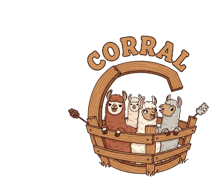
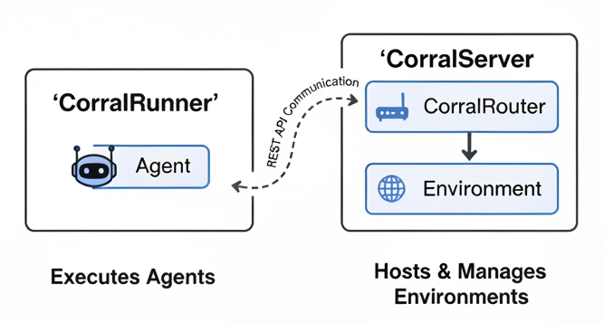

# Corral

<figure markdown>
{ title="corral" alt="corral logo"  }
</figure>

Corral is a platform for development, deployment and evaluation of environments and agents.

Corral is built and maintained with the following foundational principles in mind:

- Reproducibility: Facilitating consistent and repeatable research outcomes.

- Control: Providing precise control over all environmental and agent variables.

- Observability: Ensuring consistent monitoring and recording of all system changes.

- Efficiency and Scalability: Designed to be lightweight while capable of scaling to complex demands.

- Simplicity and Usability: Engineered for ease of understanding and straightforward application.

- Flexibility: Avoiding implementation constraints to empower diverse approaches.

<!--
Corral has value for researchers, engineers, managers and teachers looking to use

 -->

# Environments 🌍

:  The `Environment` is the "world" with which an agent or human interacts. In real world for a chemist doing synthesis, environment would be chemistry lab and for a computational scientist their PC/ HPC with softwares and internet.

:  `Environment`s define the task space (Task and the different ways to solve them) that include use of tools. Good environments give observable feedback for the agent, allowing it to make its next move.

In `Corral`, all resources and capabilities that an agent might leverage – such as specific APIs, code interpreters, or specialized data stores – are considered intrinsic components of the environment itself. This architectural choice ensures that environment design is explicit about available tools, facilitating rigorous control, strict reproducibility, and clear separation between the agent's decision-making logic and its interactive substrate.

<!-- Not sure if we should define the components of environment in detail as well. (action space, terminal condition etc) -->

The platform includes several pre-built environments:

| Environment | Description |
|-------------|-------------|
| `corral_samplemath` | Basic mathematical operations |
| `corral_spectra` | Spectroscopy data analysis |
| `corral_molecular_dynamics` | Molecular dynamics setup |
| `corral_open_catalyst` | Catalysis research tasks |
| `corral_afm` | Atomic force microscopy |
| `corral_retrosynthesis` | Plan synthesis|
| `corral_resistor` | Infer circuit topology|
| `corral_wet_lab`| Virtual lab for ion analysis |
| `corral_simple_ml`| Basic ML modeling |

# Agents 🤖

:  `Agent` is the entity responsible for perception (observing the environment) and decision-making (deciding what actions/steps to take) to solve the task.
Agents are made with LLMs in many fancy ways (commonly called scaffolds).

`Corral` treats agents as modular components, emphasizing the agent's internal architecture and learning/inference mechanisms. This modularity allows researchers to develop, train, and evaluate diverse agent designs independently of the specific environmental configurations.

The platform includes several built-in agent types:

| Agent | Description |
|-------|-------------|
| `ReAct` | Uses the ReAct (Reasoning and Acting) framework for step-by-step problem solving. |
| `ToolCalling` | Uses native function calling from LLM providers to solve tasks by leveraging built-in tool/function calling capabilities. |
| `LLMPlanner` | Uses hierarchical planning with high-level planning and low-level execution delegation to other agents. |
| `Reflection` | Empowers agents to self-evaluate their past actions and reasoning, learn from errors, and refine future strategies or plans. |

# Task 📝

:  A `Task` defines the problem an Agent is intended to solve within a particular Environment. It specifies the criteria for successful completion, and often includes a reward structure or performance metrics used for evaluating the agent's efficacy and efficiency.

In `Corral`, a task typically encompasses the core objective and can optionally include constraints that the agent must adhere to during its execution (e.g., allowed tools). Furthermore, tasks often integrate a scoring function (or callback) that quantifies the agent's performance, allowing for automated evaluation.

`Corral` also introduces the concept of `TaskGroups`, which are sequences of individual tasks chained together. These `TaskGroups` are solved in a predefined order, with the output or state from one task potentially serving as input or context for the subsequent tasks. This powerful capability allows for the construction of arbitrarily complex, multi-stage research challenges that mirror real-world problem-solving processes.

Through this formalism, `Corral` provides a flexible and robust framework for defining and evaluating intricate agent behaviors across a wide spectrum of research problems.

The platform includes several built-in tasks:

# Tools

: Tools are functionalities that can be executed by the agent to do something in the environment.

# Corral architecture TL;DR 🏗️

Corral is built upon a microservice architecture to ensure flexibility, scalability, and robust isolation of components. At its core, the platform follows a client-server design and comprises two primary services:

`CorralServer`: This dedicated microservice is responsible for hosting and managing environments and providing the interface for interaction (`CorralRouter`).

`CorralRunner`: This service is tasked with executing agents. It orchestrates the agent's lifecycle, feeding it observations, and relaying its chosen actions.

The interaction between an agent (running within corral_runner) and its environment (hosted by corral_server) occurs through REST API communication.

/// info
    open: True

<figure markdown>
{ title="corral arch" alt="corral architecture" }
<figcaption>Corral Architecture Overview</figcaption>
</figure>

Agents within Corral are designed to interact with their environments primarily using natural language.
///

## 🤝 Community

- **Issues**: Report bugs and request features on [GitHub Issues](https://github.com/lamalab-org/mat-agent-bench/issues)
- **Discussions**: Join conversations on [GitHub Discussions](https://github.com/lamalab-org/mat-agent-bench/discussions)
- **Contributing**: See our [Contributing Guide](CONTRIBUTING.md)

## 📄 License

This project is licensed under the MIT License - see the [LICENSE](LICENSE.md) file for details.
